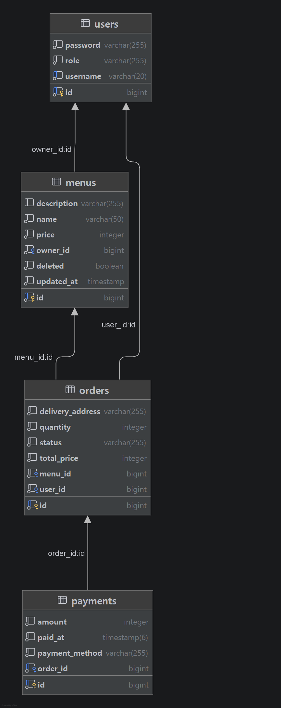

# Spring Delivery Mini

## 1. 프로젝트 소개
- 단기 심화 온보딩 주차 과제로, Spring Boot · JPA를 이용해 구현한 미니 배달 서비스

## 2. 프로젝트에서 요구/사용한 기술 스택
| 구분 | 기술 |
|---|---|
| 언어 · 프레임워크 | Java 21 · Spring Boot 4.1.x |
| 빌드 도구 | Gradle |
| 데이터베이스 | PostgreSQL 18 |
| 사용 기술 | Spring Web · Spring Data JPA · PostgreSQL Driver · Spring Security · Validation · Lombok · JWT (JJWT) |
| API 테스트 | Postman |

## 3. 프로젝트 구조

```
src/main/java/com/sparta/springdeliverymini
├── SpringDeliveryMiniApplication.java   # 실행 진입점 (@EnableJpaAuditing)
├── config
│   └── SecurityConfig.java              # URL별 접근 권한, 401/403 응답, 비밀번호 암호화(BCrypt)
├── jwt
│   ├── JwtProvider.java                 # JWT 생성·검증
│   └── JwtAuthenticationFilter.java     # 요청마다 토큰을 확인해 인증 정보 등록
├── controller
│   ├── UserController.java              # 회원가입, 로그인
│   ├── MenuController.java              # 메뉴 등록·조회·수정·삭제
│   ├── OrderController.java             # 주문 생성·조회·취소·상태 변경
│   └── PaymentController.java           # 결제
├── service
│   ├── UserService.java
│   ├── MenuService.java
│   ├── OrderService.java
│   └── PaymentService.java
├── repository
│   ├── UserRepository.java
│   ├── MenuRepository.java
│   ├── OrderRepository.java
│   └── PaymentRepository.java
├── entity
│   ├── User.java / Role.java            # 회원, 역할(CUSTOMER / OWNER)
│   ├── Menu.java                        # 메뉴 (Soft Delete)
│   ├── Order.java / OrderStatus.java    # 주문, 주문 상태
│   └── Payment.java / PaymentMethod.java # 결제, 결제 수단(CARD)
├── dto                                  # 요청(Request) / 응답(Response) 객체
└── exception
    ├── ApiException.java                # 상태 코드를 담아 던지는 예외
    └── GlobalExceptionHandler.java      # 예외를 {"message": ...} JSON 응답으로 변환
```

### 계층별 역할

| 패키지 | 역할 |
|---|---|
| `controller` | HTTP 요청을 받아 `@Valid`로 요청 값을 검증하고, 토큰에서 꺼낸 아이디(`authentication.getName()`)와 함께 Service에 넘김. 결과를 상태 코드와 함께 응답 |
| `service` | 비즈니스 로직 담당. 본인 데이터인지 확인, 주문 상태 변경 규칙, 금액 계산 등을 검증하고 실패하면 `ApiException`을 던짐. `@Transactional`로 트랜잭션 관리 |
| `repository` | `JpaRepository`를 상속해 DB 조회·저장. 메서드 이름으로 쿼리 생성 (예: `findAllByUserId`, `existsByOrderId`) |
| `entity` | DB 테이블과 1:1로 대응하는 JPA 엔티티. 상태 변경은 setter 대신 `changeStatus()`, `update()`, `delete()` 같은 의미 있는 메서드로만 가능 |
| `dto` | 요청·응답 전용 객체(`record`). 엔티티를 그대로 노출하지 않고 필요한 값만 주고받음 (예: 응답에 비밀번호 제외, 요청에 금액 제외) |
| `config`, `jwt` | Spring Security + JWT 인증. 1차 권한 검사(역할별 URL 접근)는 `SecurityConfig`, 본인 데이터 여부 같은 세부 검사는 Service에서 처리 |
| `exception` | 모든 에러 응답을 `{"message": "..."}` 형태로 통일 |

### 요청 처리 흐름

```
Client ─▶ JwtAuthenticationFilter ─▶ SecurityConfig(역할 검사) ─▶ Controller ─▶ Service ─▶ Repository ─▶ DB
                                              │                                    │
                                              └─ 401 / 403                         └─ ApiException ─▶ GlobalExceptionHandler
```

## 4. 주요 기능
### 회원
- 회원가입 및 로그인
- BCrypt를 이용한 비밀번호 암호화
- JWT 기반 인증 및 인가
- CUSTOMER / OWNER 역할(Role)에 따른 접근 권한 분리

### 메뉴
- OWNER의 메뉴 등록, 수정, 삭제
- 메뉴 조회 및 상세 조회
- 메뉴 등록은 Spring Security에서 OWNER만 허용, 수정·삭제는 Service에서 본인 메뉴 여부 검증
- Soft Delete를 통한 메뉴 삭제 처리

### 주문
- CUSTOMER의 메뉴 주문 (총액은 서버에서 `메뉴 가격 × 수량`으로 계산)
- 주문 내역 조회 (CUSTOMER는 본인 주문, OWNER는 본인 메뉴에 들어온 주문)
- 주문요청 상태에서만 주문 취소 가능
- OWNER의 주문 상태 변경 (결제완료 → 주문수락 → 배달완료)
- 주문자 / 메뉴 주인 본인 여부에 따른 접근 권한 검증

### 결제
- CUSTOMER의 본인 주문 결제
- 결제 수단 검증 (CARD만 허용)
- 결제 금액은 요청으로 받지 않고 서버에서 주문 총액을 그대로 사용
- 결제 완료에 따른 주문 상태 변경
- 중복 결제 방지 및 결제 완료된 주문의 취소 방지

### 데이터베이스 설계
- User, Menu, Order, Payment 간의 관계 설계
- 엔티티 간 외래키 설정
- 주문 및 결제 데이터의 연관관계 구성
- JPA를 활용한 데이터 접근 및 관리

### REST API 및 예외 처리
- Validation을 이용한 요청 데이터 검증
- 인증/인가에 따른 HTTP 상태 코드 처리
- 잘못된 요청, 권한 없음, 리소스 없음 등의 예외 처리

## 5. API 명세

### 공통 사항
- 인증이 필요한 API는 요청 헤더에 토큰을 담아 보냄
  ```
  Authorization: Bearer {accessToken}
  ```
- 에러 응답은 모두 같은 형식
  ```json
  { "message": "에러 메시지" }
  ```
- 공통 에러 코드

  | 코드 | 상황 |
  |---|---|
  | 400 | 요청 값 검증 실패, JSON 형식 오류 |
  | 401 | 토큰이 없거나 유효하지 않음(만료·위조), 로그인 실패 |
  | 403 | 권한 없음 (역할이 다르거나 본인 데이터가 아님) |
  | 404 | 대상(메뉴·주문)이 없음 |
  | 409 | 중복(아이디, 결제) 또는 현재 상태에서 할 수 없는 요청 |

### API 목록

| 기능 | Method | URL | 인증 | 권한 | 성공 |
|---|---|---|---|---|---|
| 회원가입 | POST | `/api/users/signup` | X | - | 201 |
| 로그인 | POST | `/api/users/login` | X | - | 200 |
| 메뉴 등록 | POST | `/api/menus` | O | OWNER | 201 |
| 메뉴 목록 조회 | GET | `/api/menus` | X | - | 200 |
| 메뉴 단건 조회 | GET | `/api/menus/{id}` | X | - | 200 |
| 메뉴 수정 | PUT | `/api/menus/{id}` | O | OWNER (본인 메뉴) | 200 |
| 메뉴 삭제 | DELETE | `/api/menus/{id}` | O | OWNER (본인 메뉴) | 204 |
| 주문 생성 | POST | `/api/orders` | O | CUSTOMER | 201 |
| 주문 목록 조회 | GET | `/api/orders` | O | CUSTOMER / OWNER | 200 |
| 주문 취소 | PATCH | `/api/orders/{id}/cancel` | O | CUSTOMER (본인 주문) | 204 |
| 주문 상태 변경 | PATCH | `/api/orders/{id}/status` | O | OWNER (본인 메뉴 주문) | 204 |
| 결제 | POST | `/api/payments` | O | CUSTOMER (본인 주문) | 201 |

### 주문 상태 흐름

```
ORDER_REQUEST(주문요청) ──결제──▶ PAYMENT_COMPLETED(결제완료) ──OWNER 수락──▶ ORDER_ACCEPTED(주문수락) ──OWNER──▶ DELIVERY_COMPLETED(배달완료)
       │
       └──CUSTOMER 취소──▶ ORDER_CANCELLED(주문취소)
```

---

### 회원

#### 회원가입 `POST /api/users/signup`
Request
```json
{ "username": "user1", "password": "password123", "role": "CUSTOMER" }
```
- `username`: 4~20자
- `password`: 8~72자 (BCrypt로 암호화해 저장)
- `role`: `CUSTOMER` 또는 `OWNER`

Response `201 Created`
```json
{ "id": 1, "username": "user1", "role": "CUSTOMER" }
```

| 코드 | 상황 |
|---|---|
| 400 | 입력 값 검증 실패, role이 CUSTOMER/OWNER가 아님 |
| 409 | 이미 사용 중인 아이디 |

#### 로그인 `POST /api/users/login`
Request
```json
{ "username": "user1", "password": "password123" }
```
Response `200 OK`
```json
{ "accessToken": "eyJhbGciOi...", "tokenType": "Bearer" }
```
- 토큰 유효 시간: 1시간

| 코드 | 상황 |
|---|---|
| 400 | 아이디/비밀번호 누락 |
| 401 | 아이디 또는 비밀번호 불일치 (어느 쪽이 틀렸는지 구분하지 않음) |

---

### 메뉴

#### 메뉴 등록 `POST /api/menus`
Request
```json
{ "name": "후라이드 치킨", "price": 18000, "description": "바삭한 치킨" }
```
- `name`: 필수, 50자 이하
- `price`: 필수, 1원 이상
- `description`: 선택, 255자 이하

Response `201 Created`
```json
{ "id": 1, "name": "후라이드 치킨", "price": 18000, "description": "바삭한 치킨", "updatedAt": "2026-10-08T14:00:00" }
```

| 코드 | 상황 |
|---|---|
| 400 | 입력 값 검증 실패 |
| 401 | 토큰 없음 |
| 403 | CUSTOMER가 요청 |

#### 메뉴 목록 조회 `GET /api/menus`
Response `200 OK` — 삭제되지 않은 메뉴만 반환
```json
[
  { "id": 1, "name": "후라이드 치킨", "price": 18000, "description": "바삭한 치킨", "updatedAt": "2026-10-08T14:00:00" }
]
```

#### 메뉴 단건 조회 `GET /api/menus/{id}`
Response `200 OK` — 메뉴 등록 응답과 같은 형식

| 코드 | 상황 |
|---|---|
| 404 | 메뉴가 없거나 삭제됨 |

#### 메뉴 수정 `PUT /api/menus/{id}`
Request / Response `200 OK` — 메뉴 등록과 같은 형식

| 코드 | 상황 |
|---|---|
| 400 | 입력 값 검증 실패 |
| 401 | 토큰 없음 |
| 403 | 본인 메뉴가 아님 (CUSTOMER 포함) |
| 404 | 메뉴가 없거나 삭제됨 |

#### 메뉴 삭제 `DELETE /api/menus/{id}`
Response `204 No Content`
- 실제로 지우지 않고 `deleted = true`로 변경 (Soft Delete) → 기존 주문 기록 유지

| 코드 | 상황 |
|---|---|
| 401 | 토큰 없음 |
| 403 | 본인 메뉴가 아님 (CUSTOMER 포함) |
| 404 | 메뉴가 없거나 이미 삭제됨 |

---

### 주문

#### 주문 생성 `POST /api/orders`
Request
```json
{ "menuId": 1, "quantity": 2, "deliveryAddress": "서울시 강남구 ..." }
```
- `quantity`: 1 이상
- `deliveryAddress`: 필수, 255자 이하
- 총액은 요청으로 받지 않고 서버에서 `메뉴 가격 × 수량`으로 계산

Response `201 Created`
```json
{
  "id": 1, "menuId": 1, "menuName": "후라이드 치킨",
  "quantity": 2, "totalPrice": 36000,
  "deliveryAddress": "서울시 강남구 ...", "status": "ORDER_REQUEST"
}
```

| 코드 | 상황 |
|---|---|
| 400 | 입력 값 검증 실패, 총액이 너무 큼(int 범위 초과) |
| 401 | 토큰 없음 |
| 403 | OWNER가 요청 |
| 404 | 메뉴가 없거나 삭제됨 |

#### 주문 목록 조회 `GET /api/orders`
Response `200 OK` — 주문 생성 응답 형식의 배열
- CUSTOMER: 본인이 한 주문만
- OWNER: 본인 메뉴에 들어온 주문만

| 코드 | 상황 |
|---|---|
| 401 | 토큰 없음 |

#### 주문 취소 `PATCH /api/orders/{id}/cancel`
Response `204 No Content` — 주문 상태를 `ORDER_CANCELLED`로 변경

| 코드 | 상황 |
|---|---|
| 401 | 토큰 없음 |
| 403 | OWNER가 요청, 본인 주문이 아님 |
| 404 | 주문 없음 |
| 409 | 주문요청 상태가 아님 (결제 완료된 주문 등은 취소 불가) |

#### 주문 상태 변경 `PATCH /api/orders/{id}/status`
Request
```json
{ "status": "ORDER_ACCEPTED" }
```
- 허용되는 변경: `PAYMENT_COMPLETED → ORDER_ACCEPTED`, `ORDER_ACCEPTED → DELIVERY_COMPLETED`

Response `204 No Content`

| 코드 | 상황 |
|---|---|
| 400 | status 누락 또는 잘못된 값 |
| 401 | 토큰 없음 |
| 403 | CUSTOMER가 요청, 본인 메뉴에 들어온 주문이 아님 |
| 404 | 주문 없음 |
| 409 | 허용되지 않는 변경 (결제 전 주문 수락, 단계 건너뛰기, 배달완료 이후 변경 등) |

---

### 결제

#### 결제 `POST /api/payments`
Request
```json
{ "orderId": 1, "paymentMethod": "CARD" }
```
- `paymentMethod`: `CARD`만 가능
- 결제 금액은 요청으로 받지 않고 주문 총액(`totalPrice`)을 그대로 사용

Response `201 Created` — 결제 내역 저장 후 주문 상태를 `PAYMENT_COMPLETED`로 변경
```json
{
  "id": 1, "orderId": 1, "amount": 36000, "paymentMethod": "CARD",
  "orderStatus": "PAYMENT_COMPLETED", "paidAt": "2026-10-08T14:05:00"
}
```

| 코드 | 상황 |
|---|---|
| 400 | 입력 값 누락, 결제 수단이 CARD가 아님 |
| 401 | 토큰 없음 |
| 403 | OWNER가 요청, 본인 주문이 아님 |
| 404 | 주문 없음 |
| 409 | 주문요청 상태가 아님 (이미 결제됨·취소됨), 중복 결제 |

## 6. 데이터베이스 / ERD
- DB: PostgreSQL
- 테이블은 JPA 엔티티를 기준으로 자동 생성 (`ddl-auto: update`)



### 테이블 관계

| 관계 | 종류 | FK | 설명 |
|---|---|---|---|
| users ─ menus | 1 : N | `menus.owner_id` → `users.id` | OWNER 한 명이 여러 메뉴를 등록 |
| users ─ orders | 1 : N | `orders.user_id` → `users.id` | CUSTOMER 한 명이 여러 주문을 생성 |
| menus ─ orders | 1 : N | `orders.menu_id` → `menus.id` | 한 메뉴에 여러 주문이 들어옴 |
| orders ─ payments | 1 : 1 | `payments.order_id` → `orders.id` (unique) | 주문 1건당 결제는 1건만 가능 |

- **OWNER가 받은 주문 조회**: `orders → menus → users(owner)` 순서로 따라가 본인 메뉴에 들어온 주문만 찾음 (`findAllByMenuOwnerId`)
- **메뉴는 Soft Delete**: 실제로 행을 지우면 그 메뉴를 참조하는 주문의 FK(`menu_id`)가 깨지므로, `deleted = true`로만 표시하고 조회에서 제외
- **중복 결제 방지**: `payments.order_id`에 unique 제약을 걸어 같은 주문의 결제가 동시에 들어와도 DB에서 한 건만 저장됨

### 테이블 상세

#### users — 회원
| 컬럼 | 타입 | 제약 | 설명 |
|---|---|---|---|
| id | bigint | PK | |
| username | varchar(20) | NOT NULL, UNIQUE | 로그인 아이디 |
| password | varchar(255) | NOT NULL | BCrypt 해시값 |
| role | varchar(255) | NOT NULL | `CUSTOMER` / `OWNER` |

> `user`는 PostgreSQL 예약어라 테이블명을 `users`로 지정

#### menus — 메뉴
| 컬럼 | 타입 | 제약 | 설명 |
|---|---|---|---|
| id | bigint | PK | |
| owner_id | bigint | FK → users.id, NOT NULL | 메뉴를 등록한 OWNER |
| name | varchar(50) | NOT NULL | 메뉴 이름 |
| price | integer | NOT NULL | 가격 |
| description | varchar(255) | | 설명 (선택) |
| deleted | boolean | | 삭제 여부 (Soft Delete) |
| updated_at | timestamp | NOT NULL | 마지막 수정 시각 (JPA Auditing 자동 기록) |

#### orders — 주문
| 컬럼 | 타입 | 제약 | 설명 |
|---|---|---|---|
| id | bigint | PK | |
| user_id | bigint | FK → users.id, NOT NULL | 주문한 CUSTOMER |
| menu_id | bigint | FK → menus.id, NOT NULL | 주문한 메뉴 |
| quantity | integer | NOT NULL | 수량 |
| total_price | integer | NOT NULL | 주문 당시 총액 (메뉴 가격 × 수량, 서버 계산) |
| delivery_address | varchar(255) | NOT NULL | 배송 주소 |
| status | varchar(255) | NOT NULL | `ORDER_REQUEST` / `ORDER_CANCELLED` / `PAYMENT_COMPLETED` / `ORDER_ACCEPTED` / `DELIVERY_COMPLETED` |

> 메뉴 가격이 나중에 바뀌어도 주문 금액이 변하지 않도록 `total_price`를 주문 시점에 따로 저장

#### payments — 결제
| 컬럼 | 타입 | 제약 | 설명 |
|---|---|---|---|
| id | bigint | PK | |
| order_id | bigint | FK → orders.id, NOT NULL, UNIQUE | 결제한 주문 |
| amount | integer | NOT NULL | 결제 금액 (주문의 `total_price`를 그대로 저장) |
| payment_method | varchar(255) | NOT NULL | `CARD` |
| paid_at | timestamp(6) | NOT NULL | 결제 시각 |

## 7. 질문이나 피드백 받고 싶은 것
### 질문 및 피드백 요청 사항

1. Spring Security / JWT 설계
- 현재 SecurityConfig에서 CUSTOMER / OWNER 역할별 접근 권한을 분리하고, Service에서 본인 데이터 여부를 추가로 검증하는 방식으로 구현했습니다.
  현재와 같은 역할 기반 접근 제어 구조에서 보완하거나 개선할 부분이 있을까요?
- JWT 인증 필터와 SecurityConfig의 역할 분리를 현재와 같이 구성하는 것이 적절한지 궁금합니다.
- 401(인증 실패)과 403(인가 실패)을 현재와 같이 구분해서 처리하는 방식이 적절한지 궁금합니다.

2. Soft Delete 설계
- 메뉴 삭제 시 실제 DELETE 대신 deleted = true로 처리하고 조회에서 제외하는 Soft Delete 방식을 적용했습니다.
  배달 주문 서비스에서 이 방식이 적절한지, 또는 deletedAt 등을 추가하는 것이 더 나은지 궁금합니다.
- 삭제된 메뉴와 기존 주문 데이터의 관계를 유지하기 위해 Soft Delete를 선택했는데, 이 설계에서 추가적으로 고려할 부분이 있을까요?

3. User · Menu · Order · Payment 데이터베이스 설계
- 현재 User–Menu(1:N), User–Order(1:N), Menu–Order(1:N), Order–Payment(1:1)로 관계를 설계하고 외래키를 설정했습니다.
  서비스 요구사항을 기준으로 현재 ERD와 엔티티 관계가 적절한지 검토받고 싶습니다.
- Payment.order_id에 UNIQUE 제약을 두어 주문 1건당 결제 1건만 허용하도록 했는데, 이러한 중복 결제 방지 방식을 DB 제약조건으로 처리하는 것이 적절한지 궁금합니다.
- 주문에서 total_price를 별도로 저장하여 주문 당시의 가격을 보존하도록 했는데, 메뉴 가격 변경을 고려했을 때 현재 데이터 모델이 적절한지 궁금합니다.

4. 트랜잭션 처리
- 결제 시 Payment 저장과 Order 상태 변경을 하나의 @Transactional로 묶었습니다.
  현재와 같이 결제와 주문 상태 변경을 하나의 트랜잭션으로 처리하는 것이 적절한지, 추가적으로 고려할 동시성 문제가 있는지 궁금합니다.

5. 전체적인 설계
- 현재 Controller → Service → Repository 계층으로 분리하고 DTO를 통해 요청/응답을 처리했는데, 신입 개발자 포트폴리오 수준에서 구조적으로 부족하거나 개선할 부분이 있는지 피드백 받고 싶습니다.
- 현재 구현에서 실제 운영 환경을 고려했을 때 가장 먼저 개선해야 할 부분이 무엇인지 궁금합니다.

굳이 다 답변해주실 필요는 없지만 1, 4, 5를 중점으로 피드백 받고 싶습니다.